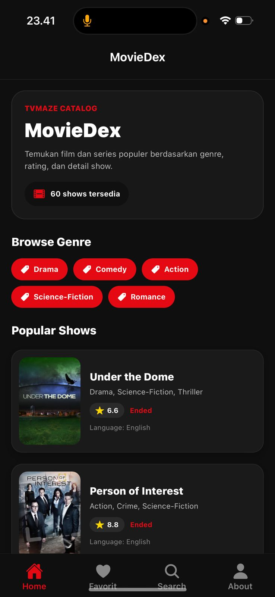
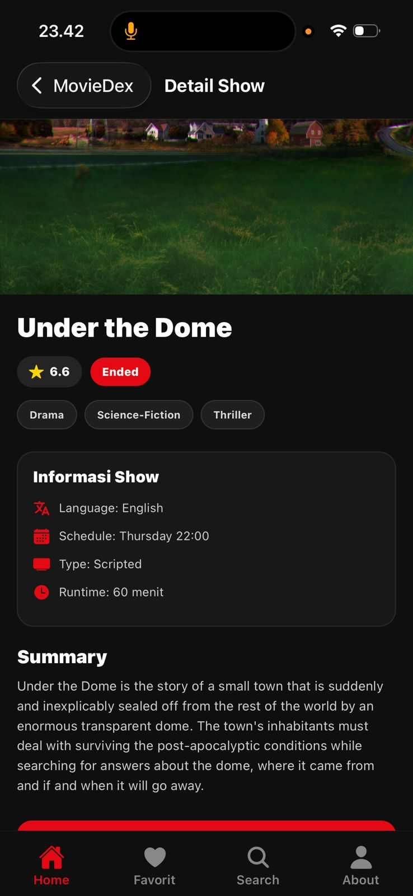
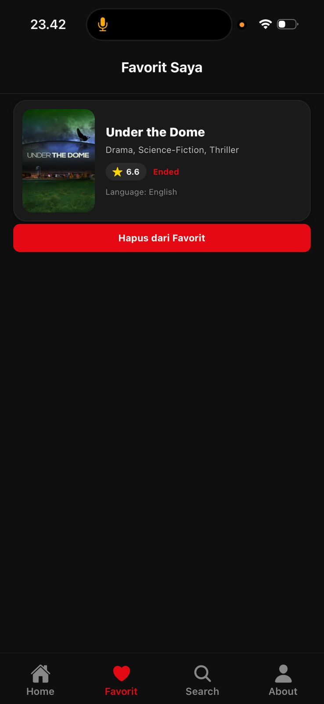
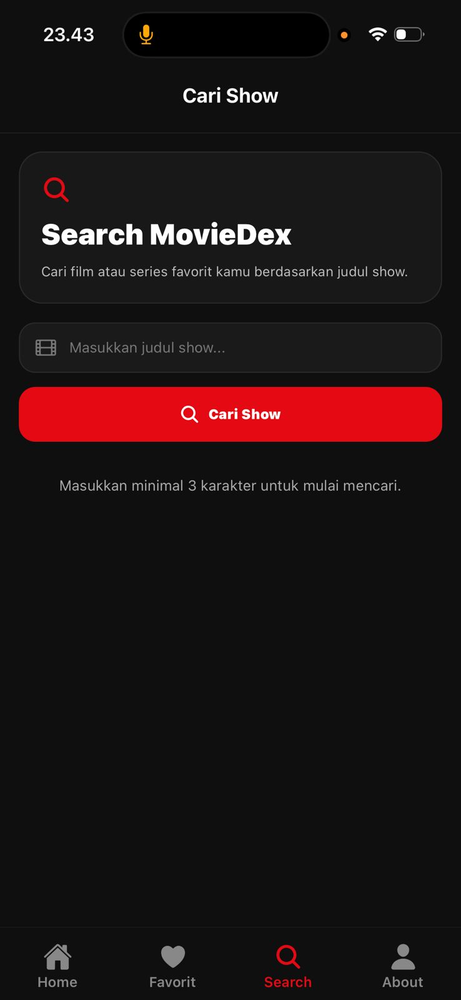
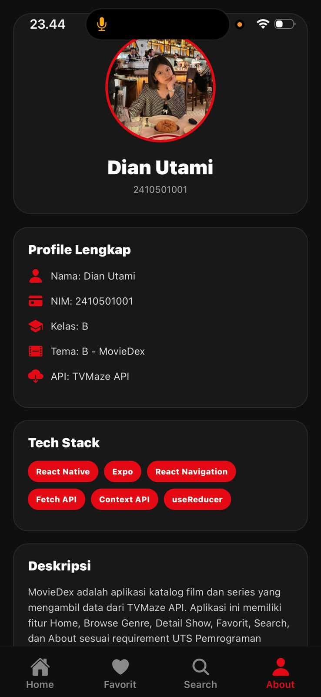

## MovieDex - Aplikasi Katalog Film & Series
- Nama: Dian Utami
- NIM: 2410501001
- Kelas: B

## Tema Project
Tema yang dipilih: **B**

## Tech Stack
- React Native
- Expo
- React Navigation
- Fetch API
- Context API (useReducer)

## Versi (diambil dari package.json)
- expo: ^50.x.x
- react: ^18.x.x
- react-native: ^0.73.x
- @react-navigation/native
- @react-navigation/bottom-tabs
- @react-navigation/native-stack

## Cara Install & Run

git clone https://github.com/DianUtami3/uts-mobile-lanjut-2410501001-DianUtami.git
cd uts-mobile-lanjut-NIM-NAMA
npm install
npx expo start

## Link Demo YouTube

## Penjelasan State Management
Alasan:
- Lebih sederhana dibanding Redux
- Cocok untuk aplikasi skala kecil-menengah
- Tidak perlu install library tambahan
- Mudah digunakan untuk fitur favorit

Implementasi:

- FavoriteContext.js
- Menyimpan list show favorit
- Memiliki fungsi:
1. addFavorite
2. removeFavorite
3. isFavorite
   
## Screenshot
- 
- 
- 
- 
- 
- 
## Daftar Referensi 
1. React Navigation Documentation  
   https://reactnavigation.org/docs/getting-started
2. Expo Documentation  
   https://docs.expo.dev/
3. React Native Official Documentation   
   https://reactnative.dev/docs/getting-started
4. Fetch API (MDN Web Docs)   
   https://developer.mozilla.org/en-US/docs/Web/API/Fetch_API
5. TVMaze API Documentation   
   https://www.tvmaze.com/api
6. React Context API & useReducer  
   https://react.dev/reference/react/useContext  
   https://react.dev/reference/react/useReducer
7. FlatList React Native  
   https://reactnative.dev/docs/flatlist
8. ActivityIndicator React Native  
   https://reactnative.dev/docs/activityindicator
9. Stack Overflow (Debugging Reference)  
   https://stackoverflow.com/

## Refleksi
Selama pengerjaan aplikasi ini, Saya mengalami beberapa kesulitan. Salah satunya selalu error dibagian Navigation, karena ketika terjadi konflik antar Expo Router dan React Navigation dapat menyebabkan aplikasi tidak berjalan. Dari proses pengerjaan ini, saya belajar bagaimana mengelola state menggunakan Context API, memahami struktur project React Native, serta debugging error yang muncul di console. Saya juga memahami pentingnya struktur folder yang rapi dan penulisan path yang benar. Selain itu, saya juga belajar bagaimana mengintegrasikan API eksternal dan menampilkan data secara dinamis dalam aplikasi mobile.
